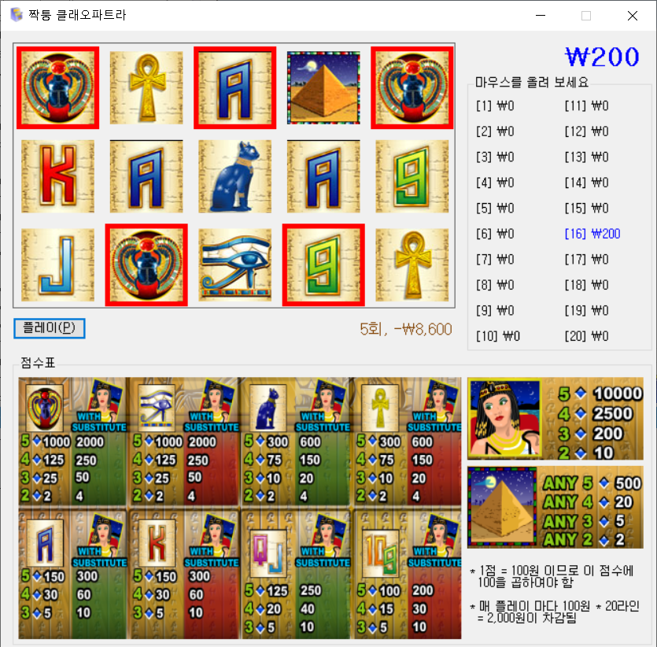
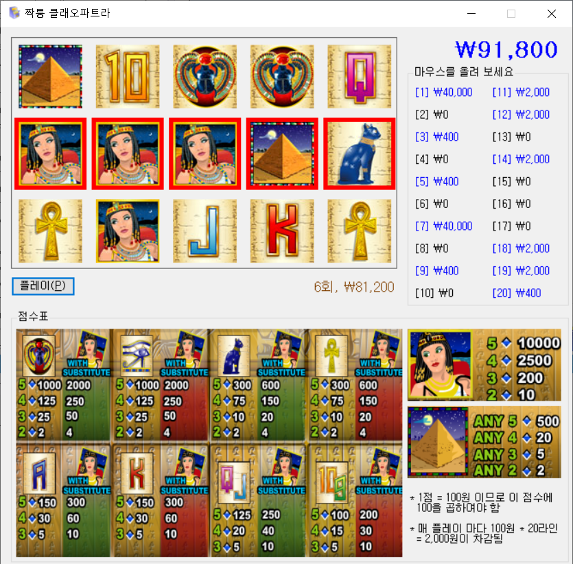
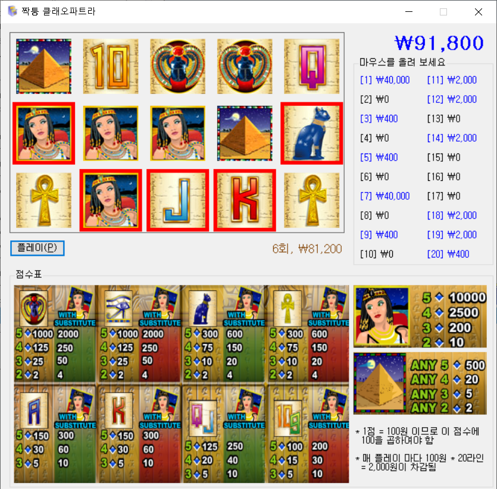
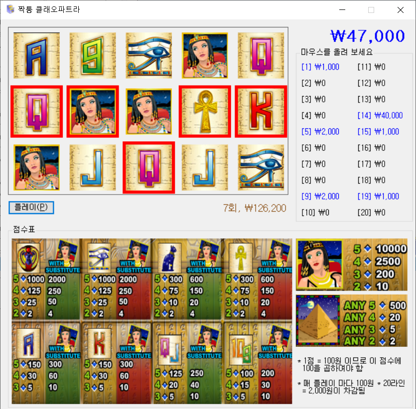

# 짝퉁 클레오파트라

* `클레오파트라`라는 슬롯 머신 게임을 복제
* 슬롯 머신의 당첨 확률을 시뮬레이션 하기 위해 개발

---------------------------------------
## 실행 방법
1. [다운로드](https://github.com/cplkimth/Slot/releases/download/v1.0/Slot.Winform.zip) 후 Slot.Winform.exe 실행

## 스크릿 샷

## 문제점
- 플레이할 수록 비정상적으로 당첨금이 높아지는 현상이 발생
- 원인은 각 심볼이 동일한 확률로 나온다고 잘못 가정한 것으로 추정됨
